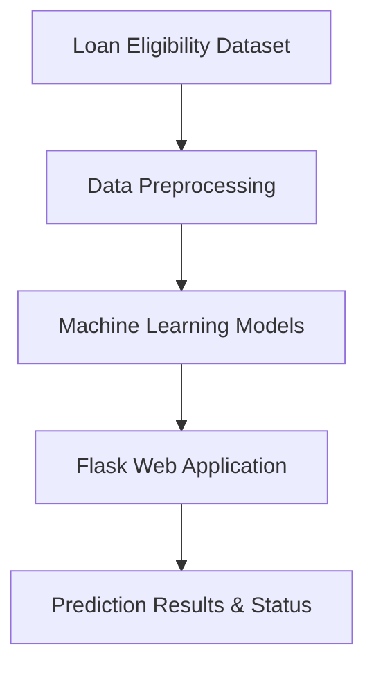
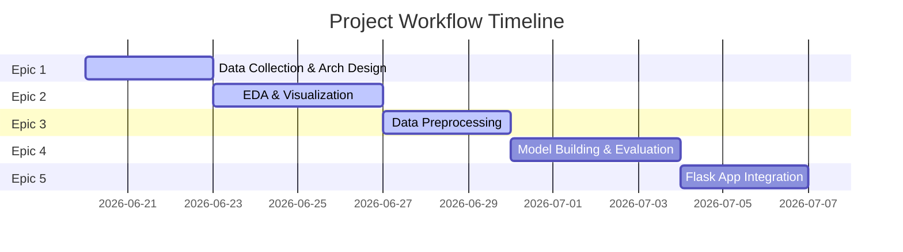

# Smart Lender - Project Summary

This document provides a comprehensive overview of the **Smart Lender – Loan Eligibility Prediction System** project. It integrates the database design, project workflow phases, and technology stack.

---

## 🏗️ Project Architecture & Components

The system consists of several integrated components that process loan application data and predict loan eligibility.

### Key Subsystems

1. **Data Ingestion & Preprocessing**: Handles dataset collection, cleansing (missing values via mean/mode imputation), and scaling.
2. **Machine Learning Model Registry**: Compares models (Decision Tree, Random Forest, KNN, XGBoost) and exports the best-performing model.
3. **Flask Web Application API**: Provides a web-based prediction form for credit officers or applicants.

---

## 🗄️ Database Design (Entity-Relationship)

The system manages user profiles, credit history, loan applications, and ML predictions using the database structure visualized below.

### ER Diagram

### Key Entities
* **USER**: System users (applicants or credit officers).
* **APPLICANT_PROFILE**: Personal details of applicants.
* **CREDIT_HISTORY**: Credit history and score records.
* **LOAN_APPLICATION**: Details of the submitted loan applications.
* **MODEL**: Information on the trained machine learning models.
* **PREDICTION_RESULT**: Model predictions matched to loan applications.

---

## 🔄 Machine Learning Workflow

The project is executed in five major epics following the standard Machine Learning lifecycle:

### Workflow Diagram

---

## 🛠️ Technology Stack

Below is the list of tools and libraries used in this project:

| Technology | Purpose | Documentation / Link |
| :--- | :--- | :--- |
| **Anaconda Navigator** | Environment & Package Management | [anaconda.com](https://www.anaconda.com/download) |
| **PyCharm** | Python Integrated Development Environment (IDE) | [jetbrains.com](https://www.jetbrains.com/pycharm/) |
| **NumPy** | Numerical Operations & Multidimensional Arrays | [numpy.org](https://numpy.org/doc/stable/) |
| **Pandas** | Data Processing & Table Manipulations | [pandas.pydata.org](https://pandas.pydata.org/docs/) |
| **Scikit-learn** | Machine Learning Training & Evaluation | [scikit-learn.org](https://scikit-learn.org/stable/) |
| **Matplotlib** | Core Visualization & Graph Plotting | [matplotlib.org](https://matplotlib.org/stable/) |
| **Seaborn** | Advanced Statistical Data Visualizations | [seaborn.pydata.org](https://seaborn.pydata.org/) |
| **Flask** | Lightweight Web Application Server | [flask.palletsprojects.com](https://flask.palletsprojects.com/) |

---

## 📂 Source Files

You can inspect the original source files in the project workspace:
- [software_and_tools.md](file:///C:/Users/ADMIN/.gemini/antigravity/scratch/smart-lender-erd/software_and_tools.md)
- [project_links.md](file:///C:/Users/ADMIN/.gemini/antigravity/scratch/smart-lender-erd/project_links.md)
- [project_workflow.md](file:///C:/Users/ADMIN/.gemini/antigravity/scratch/smart-lender-erd/project_workflow.md)
- [README.md](file:///C:/Users/ADMIN/.gemini/antigravity/scratch/smart-lender-erd/README.md)
